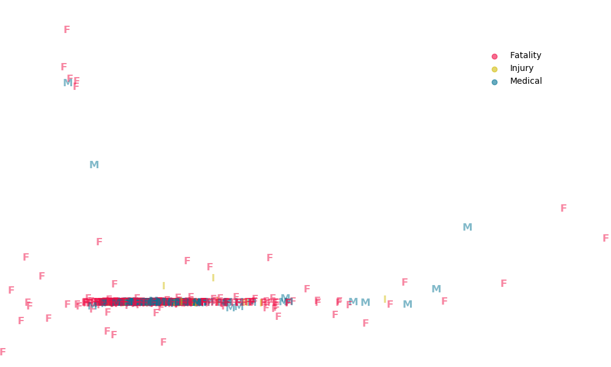

# Background

 
The American Whitewater Accident Database catalogs over 2,400 fatalities and close calls on whitewater rivers dating back to 1972.
 
The project was initiated in 1975 when Charlie Walbridge observed a fatality due to foot entrapment at a slalom race. Ever since, the American Whitewater journal has collected incident reports and shared the lessons learned. In 2017, the collection of accidents was refined and made available for download on [American Whitewater's website](https://www.americanwhitewater.org/content/Accident/view/).
 
These reports provide a learning opportunity to the paddling community, and facilitate dialogue with river managers and decision makers.
 
The goal of this repository is to identify factors that can turn a near miss into a fatality, hopefully reducing tragedies and statistics alike.
 
<!-- # Vocabulary
Foot Entrapment

 
Pin / Wrap

 -->
 
 
# Data
 
## American Whitewater Accident Database
 
The data is a combination of user submitted forms and web-scrapped articles. As such, it is supremely messy.

 
## Features
 
After deleting personal information, all text features are combined into the `description` column. In addition to the written narrative, this analysis focuses on:
* State (location)
* River level
* River difficulty
* Victim age
* kayak
* commercial
* experience
* Type of accident
   * Fatality
   * Medical (near miss)
   * Injury (near miss)
 
 
# EDA
## `description`
 
Because the descriptions of accidents are aggregated from both external websites and user submitted forms, the documents have very inconsistent structure.
 
All documents have some level of `html` embedded in them, and some are actually in `json`. The first step in the text analysis is to convert each document into one long string. The strings are then tokenized with a purpose-built function. [Spacy's](https://spacy.io) english stop words are used as a base to start. Because of inconsistent description tense, the documents are lemmatized into their root words before being vectorized into a tf-idf matrix.
 
### K-means
Hard clustering of the tf-idf matrix is used to find underlying structure.
 

 
Typically, some clusters identify more `html` words to add to the custom tokenization script.
 

 
After many iterations, the clustering still identifies more stop words, but salient topics emerge.
 

 
   1) some stopwords, accidents clustered on drugs
   3) man-made hazards
   4) east coast boating
   5) Idaho rivers
   7) more stopwords
 
### PCA
 
Primary component analysis proves to be unilluminating. Less than 0.1% of the variance is explained in the first 8 components.
 
Below, the first two components are plotted with each accident labeled as a fatality, injury, or a medical emergency.
 

 
### LDA
 
Latent Dirichlet Analysis also fails to reveal new information.
 

 
### Description Length
 
As the descriptions become longer, a higher proportion of the accidents are fatal.
 

 
## Non-text Features
 
The number of accidents is likely proportional to the amount of whitewater recreation in a given state.
 

 
The raw number of accidents has increased over time, but this is unadjusted for population and sport popularity.
 

 
 
# Pipeline
## Text
Text from the river, section, location, waterlevel, and cause features are added into the description column.
 
The description column is tokenized, lemmatized, and vectorized before analysis.
 
## Categorical
River level (Low, Medium, High, and Flood), river difficulty (I, II, III, IV, V), and victim skill (Inexperienced, Some experience, Experienced, Expert) are mapped linearly to integers.
 
Type of watercraft wareas mapped to kayak (1) or not.
 
Trip type are mapped to commercial (1) or not.
 
Given an unreasonable number of 0 year olds with contradictory description entries, ages equal to 0 were dropped.
 
# Models
Sklearn grid searching is used to find the best hyperparameters. Models are tested on classification into three groups (Fatality, Injury, Medical) as well as Fatal or Not Fatal. For simplicity and interpretability, only the binary classification results are shown.
 

|          Model    | Precision     | Recall    | Accuracy  |
|---------------:   |-----------    |--------   |---------- |
| Random Forest     | 77%           | 98%       | 81%       |
| AdaBoost          | 86%           | 92%       | 86%       |
| Bagging           | 87%           | 92%       | 87%       |
| Naive Bayes       | 76%           | 95%       | 79%       |
| Logistic Classification   | 92%           | 100%      | 92%       |
| NB, LC Stacked            | 88%           | 92%       | 84%       |

 
## Text Classification
Tf-idf and tf matrices are compared.  Models are adjusted with k-folds cross validation and final performance is judged on a holdout data set.

### Boosting

 
 
### Bagging
Below are the most important words for predicting the outcome of an accident. It is worth noting that the model does not assert a positive or negative correlation, just predictive importance.

 
### Naive Bayes
 
Below, mock descriptions were fed into the naive bayes model with the resulting predictions.
 
#### Medical
   There was a diabetic on our trip. He forgot his insulin. He ended up in DKA, so we pulled off of the the riveLuckily we had cell service, so we called 911. He got rushed to the ER, but the docs said he'd be okay even though he had been near death earlier that day. Another person on the trip was doing a bunch of drugs like xanax, accutane, tramadol and propecia. What a combo! They ended up falling in the river.
 

|                           | Medical   | Injury    | Fatality  |
|----------------------:    |---------  |--------   |---------- |
| Predicted Probability     | 99.9%     | 0.0%      | 0.0%      |

#### Injury
   It was the end of the day, and everyone was tired. The raft guide decided to drop into the last hole sideways, and dump trucked everyone into the river. There wasn't much rapid left at the point but most people found a rock or two to hit. Sarah bruised her leg. Sam hit his head. I got my foot trapped in the webbing of raft. Everyone was okay, but a few of us had to get stitches.

|                           | Medical   | Injury    | Fatality  |
|----------------------:    |---------  |--------   |---------- |
| Predicted Probability     | 0.1%      | 0.1%      | 99.8%     |

#### Fatality
   It could have been a good day of kayaking. The water levels were very high, but everyone was stoked. On the first rapid Jack capsized and swam into a strainer. Meanwhile, Jill got pinned in a sieve. Both spent about 10 minutes underwater before we could get to them. We performed CPR, but they we both blue. We called the sheriff, the ambulance came, and we cried a bunch.

|                           | Medical   | Injury    | Fatality  |
|----------------------:    |---------  |--------   |---------- |
| Predicted Probability     | 0.25%     | 0.15%     | 99.6%     |

Finally, for each category of incident, the top 100 words that made each category more and less likely were generated. Below is a curated subset of those lists.
#### Words that made Medical more likely:
    kayaker overdose, new, head, alcohol, xanax, tramadol, fall, rope

#### Words that made Injury more likely:
    man, pin, foot, strainer, group, kayaker, march

#### Words that made Fatality more likely:
    rock, dam, drown, pin, get help, search, rescue, time, large flow

#### Words that made Fatality less likely:
    competent group, thank, support, train, feel emotion, professional sar, respond
 
#### Words that made Injury less likely:
    farmer wetsuit, near drowning, new york, large kayak
 
## Logistic Regression
 
A simple logistic was performed on the non-text features. This model performed better than the text analysis. After removing features without predictive strength, the coefficients and their p-values are listed below. The variance inflation factors are all 1.3 or below.

|          Predictor    | Coef      | p-value   |
|-------------------:   |-------    |---------  |
| River Level           | 0.27      | 0.050     |
| River Difficulty      | 0.45      | 0.003     |
| Paddler Experience    | -0.34     | 0.034     |

 
## Stacked
 
Adding the Naive Bayes prediction as a feature in the logistic model, oddly, decreased performance.
 
 
# Conclusions
 
Combining the information from clustering, topic modeling, natural language processing, and logistic modeling, a few conclusions can be made. However, mostly the data supports existing knowledge in the whitewater community.
 

* Competent group - more than any other, this phrase decreased the likelihood of a prediction for death. Always make sure that your whole group is skilled enough and prepared for the river.

* Wetsuits reduce the liklihood of injury

* Dams (clustered with low, head) are more deadly 

* Rivers tend to become more lethal as the water level increases

* Rivers tend to become more lethal as their difficulty increases

* As paddler experience increases, the liklihood of fatality decreases

* Age (above 10 years old), type of watercraft, and being on a commercial trip do not change the prediction of a fatality

* 80% of accidents where the victim is less than 18 years old are fatal
 
# Further
* Further modification of the tokenization, lemmatization, and vectorization could improve the models.
* More models could be tried, such as a MLP
* Stay safe out there!
 
 

